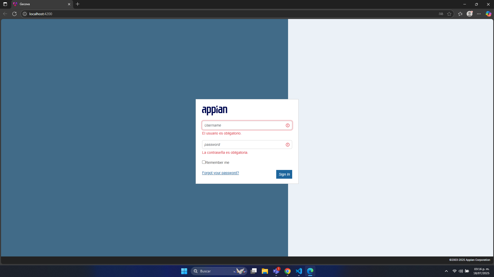
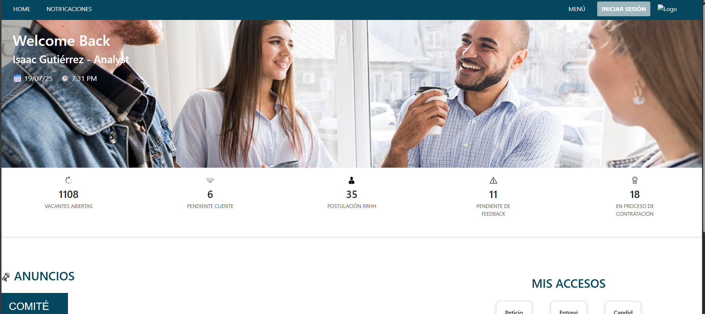
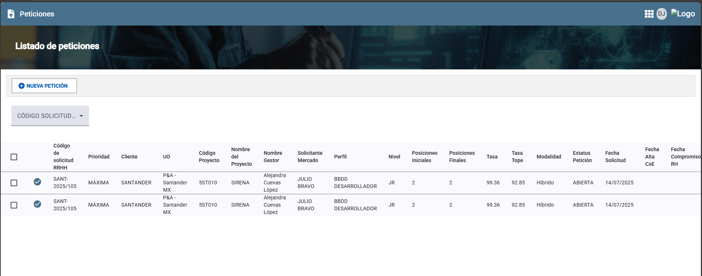
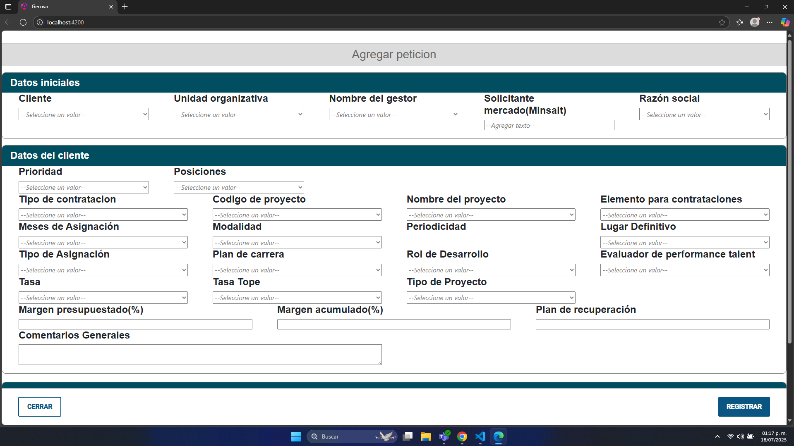

# Proyecto Gecova - Peticiones

Login, perimte el ingreso a la aplicacion. Contiene validaciones del lado del cliente.

Una vez autenticado el usuario, se peude acceder a la vista de home.

En el home es apreciable los botones de peticiones, se puede accedera las petiones
que tiene cada usuario presionando el boton de Peticion lo cual dirige a una vista diferente.

Para agregar una nueva peticion se puede presionar el boton de Nueva peticion, esta acción
despliega un formulario.

